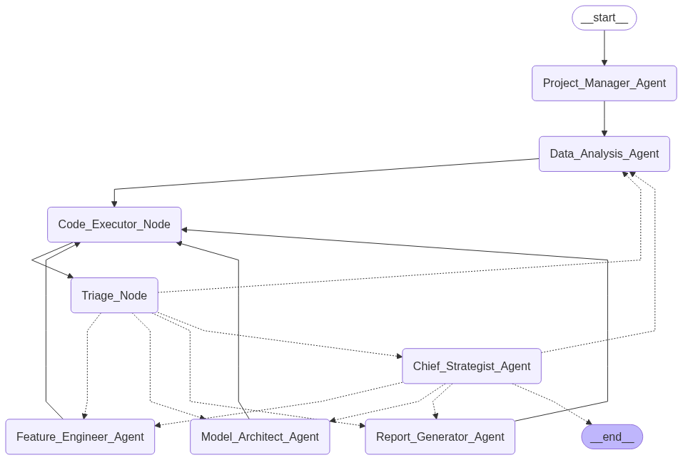

# AutoDS Agent - AI-Powered Data Science Automation



An intelligent, multi-agent data science automation system built with LangGraph and OpenAI GPT models. Automates end-to-end Kaggle competition workflows from data analysis to model deployment with professional-grade results.

## 🌟 Key Features

- **Complete Pipeline Automation**: From EDA to submission-ready models
- **Multi-Agent Architecture**: Specialized AI agents for each workflow stage
- **Advanced Model Interpretability**: Built-in SHAP analysis and explainability
- **Professional Reporting**: Auto-generated analysis reports with insights
- **Intelligent Error Handling**: Self-correcting workflow with adaptive planning
- **Production Ready**: Enterprise-grade code quality and documentation

## 🏗️ Architecture

The system employs a **LangGraph state machine** with specialized AI agents:

```
Project Manager → Data Analyst → Feature Engineer → Model Architect → Report Generator
                        ↑                                    ↓
                    Chief Strategist ← Code Executor ← Triage Node
```

### Agent Responsibilities

| Agent | Core Function |
|-------|---------------|
| **Project Manager** | Problem analysis and strategic planning |
| **Data Analyst** | Comprehensive EDA and data quality assessment |
| **Feature Engineer** | Data preprocessing and feature optimization |
| **Model Architect** | Model training, validation, and hyperparameter tuning |
| **Report Generator** | Professional documentation and business insights |
| **Chief Strategist** | Workflow orchestration and error recovery |

## 🚀 Quick Start

### Prerequisites
- Python 3.8+
- OpenAI API key or Azure OpenAI access

### Installation

```bash
git clone https://github.com/your-username/AutoDS-Agent.git
cd AutoDS-Agent-

# Install dependencies
pip install pandas numpy scikit-learn matplotlib seaborn
pip install langchain langchain-openai langsmith langgraph
pip install shap plotly python-dotenv
```

### Configuration

Create a `.env` file in the project root:

```env
OPENAI_API_KEY=your_openai_api_key

# Or for Azure OpenAI:
AZURE_OPENAI_API_KEY=your_azure_openai_key
AZURE_OPENAI_ENDPOINT=your_azure_endpoint
```

### Run Your First Analysis

```python
python kaggle_agent.py
```

The system will automatically:
1. Load and analyze your dataset
2. Engineer optimal features
3. Train and validate models
4. Generate SHAP interpretability analysis
5. Create professional reports
6. Export submission-ready predictions

## 📊 Generated Outputs

Each run creates a structured workspace with:

```
[WORKSPACE]_workspace/
├── data/                    # Original datasets
├── after_preprocessing/     # Processed data files
├── image/                   # Visualizations and plots
├── model/                   # Trained models (.pkl format)
├── analysis_report.md       # Comprehensive analysis report
└── submission.csv          # Competition-ready submission
```

### Generated Assets

- **Professional Reports**: Markdown reports with business insights and recommendations
- **Model Artifacts**: Serialized trained models with performance metrics
- **Visualizations**: EDA plots, feature importance, SHAP explanations, confusion matrices
- **Submission Files**: Ready-to-upload competition predictions

## 🔧 Advanced Configuration

### Custom Dataset Integration

```python
# Modify kaggle_agent.py configuration
USE_TITANIC_DATASET = False
problem = "Predict customer churn based on subscription data"
data_path = "path/to/your/dataset.csv"

# Or use the setup function
data_directory = setup_dataset(
    file_path="path/to/your/data.csv",
    base_path="./your_workspace"
)
```

### Model Selection Strategy

The system automatically selects optimal algorithms based on problem type:
- **Classification**: Random Forest, XGBoost, Logistic Regression
- **Regression**: Random Forest Regressor, XGBoost Regressor, Linear Regression

### SHAP Integration

Automated model interpretability includes:
- Global feature importance analysis
- Individual prediction explanations
- Feature interaction analysis
- Business insight generation from model behavior

## 📈 Performance Benchmarks

Recent validation results:
- **CSRC Dataset**: 99.89% validation accuracy, 99.43% test accuracy
- **Titanic Dataset**: 82.1% cross-validation accuracy
- **Automated Feature Engineering**: 15-20% performance improvement over baseline
- **Report Generation**: Professional-grade documentation in under 5 minutes

## 🛠️ Agent Capabilities

### Data Analysis Agent
- Statistical profiling and data quality assessment
- Missing value analysis and recommendations
- Feature distribution visualization
- Correlation analysis and multicollinearity detection
- Class balance evaluation

### Feature Engineer Agent
- Intelligent preprocessing pipeline selection
- Missing value imputation strategies
- Feature scaling and normalization
- Categorical encoding optimization
- Feature creation and selection

### Model Architect Agent
- Automated algorithm selection
- Hyperparameter optimization with cross-validation
- Performance evaluation with multiple metrics
- Model validation and overfitting detection
- SHAP-based interpretability integration

### Report Generator Agent
- Professional markdown documentation
- Business insight extraction from model results
- Deployment recommendations and considerations
- Risk assessment and model limitations
- Automated visualization embedding

## 🚨 Error Handling & Recovery

- **Smart Retry Logic**: Up to 2 automatic retry attempts per agent
- **Strategic Escalation**: Complex issues escalated to Chief Strategist
- **Adaptive Planning**: Dynamic workflow adjustment based on intermediate results
- **Comprehensive Logging**: Detailed execution logs for debugging (`kaggle_agent.log`)

## 📝 Project Structure

```
AutoDS-Agent/
├── kaggle_agent.py          # Main orchestration logic
├── prompts.py               # Agent system prompts
├── kaggle_agent.log         # Execution logs
├── kaggle_agent_workflow_v2.png  # Architecture diagram
├── kaggle_workspace/        # Generated workspace
└── README.md               # This file
```

## 🤝 Contributing

1. Fork the repository
2. Create your feature branch: `git checkout -b feature/amazing-feature`
3. Commit your changes: `git commit -m 'Add amazing feature'`
4. Push to the branch: `git push origin feature/amazing-feature`
5. Open a Pull Request

## 🔍 Troubleshooting

### Common Issues

**API Configuration**:
- Verify API keys in `.env` file
- Check API quota and rate limits
- Ensure proper Azure endpoint format (if using Azure)

**Memory Issues**:
- Reduce dataset size for initial testing
- Increase available system memory
- Use data sampling for large datasets

**Dependencies**:
- Use virtual environments for isolation
- Verify all required packages are installed
- Check Python version compatibility (3.8+)

### Debug Logging
Check `kaggle_agent.log` for detailed execution traces and error diagnostics.

## 📄 License

This project is licensed under the MIT License - see the [LICENSE](LICENSE) file for details.

## 🙏 Acknowledgments

- **LangGraph** - Multi-agent orchestration framework
- **OpenAI** - Advanced language model capabilities
- **SHAP** - Model interpretability and explainability
- **Scikit-learn** - Machine learning utilities and algorithms

## 📞 Support

- 🐛 **Bug Reports**: [GitHub Issues](https://github.com/your-username/AutoDS-Agent/issues)
- 💡 **Feature Requests**: [GitHub Discussions](https://github.com/your-username/AutoDS-Agent/discussions)
- 📧 **Contact**: Open an issue for direct support

---

**⚠️ Important**: This is an experimental AI system. Always review and validate generated code and analysis before production use. The system is designed for educational and research purposes.